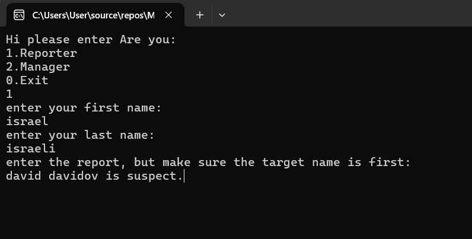
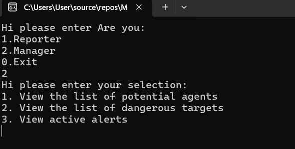

# Malshinon

**Malshinon** is a simulation of an intelligence system that allows users to report on others, track mentions and reports, and classify individuals based on their activity. It includes logic to detect potential agents and flag dangerous targets.

## Project Structure

### People
Represents an individual in the system. Contains:
- `id`
- `first_name`, `last_name`
- `secret_code` (generated from name)
- `type` (reporter / target / both)
- `num_reports` (how many reports they submitted)
- `num_mentions` (how many times they were mentioned)
- `is_dangerous` (boolean flag)

### Report
Represents a single report. Includes:
- `id`, `reporter_id`, `target_id`
- `text`
- `timestamp` (string-based)

### Manager
Handles the full reporting process:
- Takes user input for reporter and report content.
- Parses and identifies the target.
- Checks if reporter/target exist in the system.
- Updates person status (`reporter`, `target`, `both`, or `potential_agent`).
- Logs new reports and triggers alerts for targets with 3+ reports in 15 minutes.

### HelpManager
A utility class that:
- Interacts with the user through the console.
- Creates new people and reports.
- Generates secret codes.
- Extracts target names from report text.

### SecretCode
A static class that generates a unique "secret code" from the reporter's first and last names using alternating characters.

## How to Run

1. Open the solution in Visual Studio.
2. Ensure all required namespaces are referenced correctly.
3. Run `Program.cs`, which starts the application via the `Menu` class.

> Note: This project assumes a data access layer (`Dal`) exists with all relevant methods like `InsertNewPerson`, `GetPersonByName`, `InsertIntelReport`, etc.

## Features

- Console-based user input.
- Automatic person creation if not found.
- Target detection and mention count updates.
- Agent detection based on report count and length.
- Danger alerts triggered by frequent reports.
- Clear separation between input logic, business logic, and data access.

## Technologies Used

- C# (.NET Framework)
- Console Application
- Basic OOP Principles

## TODO / Future Improvements

- Add real-time timestamp handling.
- Store and retrieve data from a persistent database.
- Create a GUI version (WinForms/WPF or Web).
- Unit tests for all core logic.

## Example Interaction

